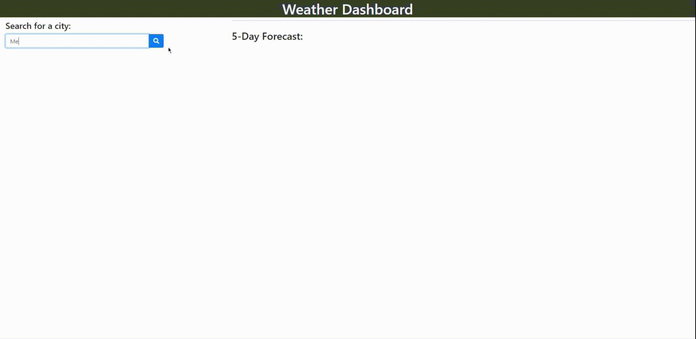

# Weather-Dashboard

## Purpose

**Displays the current and future weather for a city given a users input**

## Features

* Allows the user to search for a city.
    * Displays the current weather for that city
        * Displays the city name
        * Displays the current date
        * Displays an icon depicting the current weather
        * Displays the current temperature
        * Displays the current humidity
        * Displays the current UV Index
    * Displays the 5*day forecast for that city
        * Displays the future date
        * Displays an icon depicting the future weather
        * Displays the estimated temperature
        * Displays the estimated humidity
* Saves your previously searched cities
* Allows the user to call back on a previously searched city by clicking on it.

## Made By

Josh Miller

### Languages

* HTML
* CSS
* JavaScript

### The Functioning Product

[Where to find it](https://sithSlave.github.io/weather-dashboard)